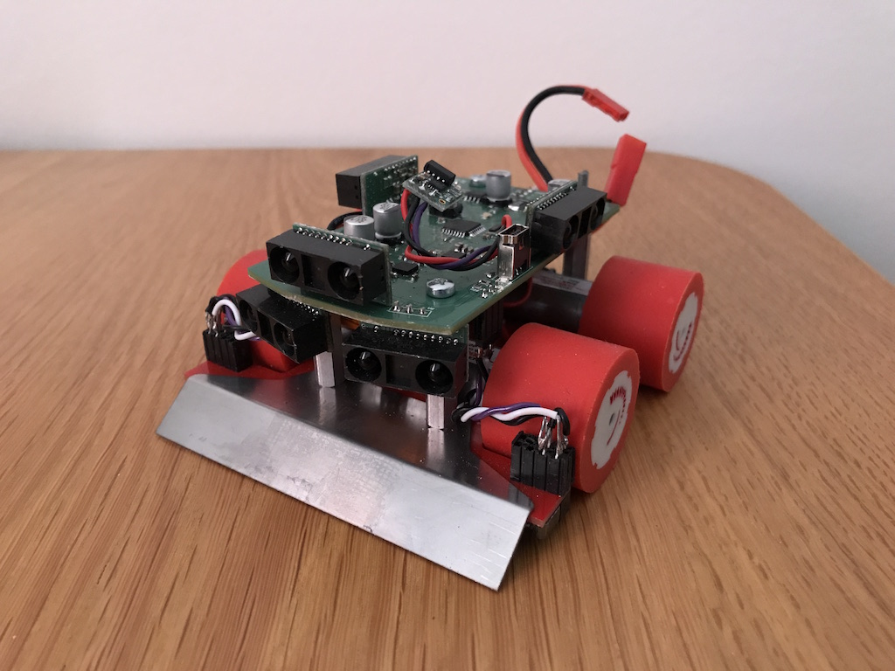
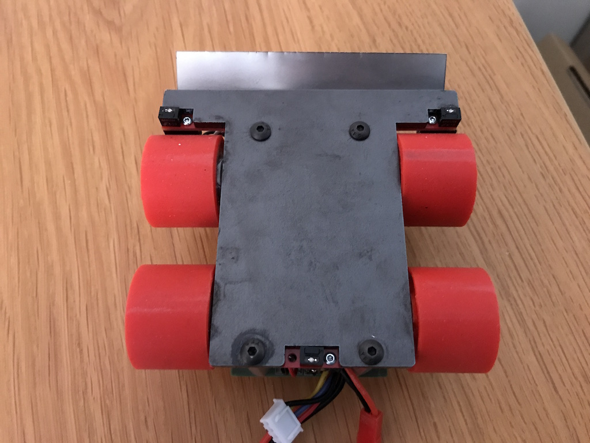

# Sumobot Agent

[Wikipedia](https://en.wikipedia.org/wiki/Robot-sumo):
> Robot-sumo, or pepe-sumo, is a sport in which two robots attempt to push each other out of a circle (in a similar fashion to the sport of sumo). The robots used in this competition are called sumobots.
> The engineering challenges are for the robot to find its opponent (usually accomplished with infrared or ultra-sonic sensors) and to push it out of the flat arena. A robot should also avoid leaving the arena, usually by means of a sensor that detects the edge.

The purpose of this project is to explore and apply AI/ML/RL techniques to a sumobot, and if successful, attend the [Swedish Robotics Championship](https://www.robotsm.se/home/) in the mini-sumo class.

## Existing Hardware
The hardware is certainly not state of the art in the world of sumo robots, but should be a good start.

* Five IR-sensors aimed to the front and the sides for measuring distance to the opponent
* Three IR-sensors aimed towards the ground for detecting the white circle edge
* 3-axis gyro+accelerometer+compass sensor (MPU-9150)
* Four DC motors, controllable in left/right-pairs
* Arduino-compatible Atmega 328 MCU
* Li-Po 3S (11.1 V) battery

Raspberry Pi is planned to be used for running the algorithms.

